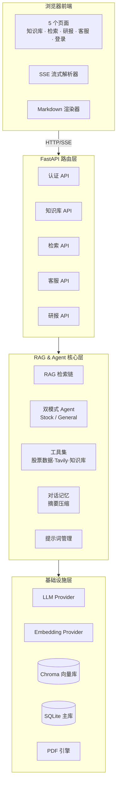

# 知识库 RAG + AI 股票研报助手

> 基于 LangChain + DeepSeek/千问/Ollama + Chroma 的多模态 RAG 系统，集成股票研报 Agent、万能助手、智能客服、知识库管理与生产级 PDF 研报生成能力。

---

## ✨ 项目简介

本项目是一个面向中文场景的智能助手平台，融合了 **RAG 知识库问答**、**AI 股票研报 Agent**、**万能助手模式切换**、**会话持久化**、**生产级 PDF 研报生成** 等能力于一体。用户可上传文档构建私有知识库，通过对话式界面进行检索问答；也可输入股票代码获取 AI 自动调用多源财经数据生成的深度研报，并按需一键导出精美 PDF。

### 核心能力一览

| 能力 | 说明 |
|------|------|
| 📚 **知识库 RAG** | 上传 txt/md/pdf 自动切分入库，问答时基于检索增强生成，答案带 [来源N] 脚注 |
| 📈 **股票研报 Agent** | LangChain Agent 自动调用 7 个股票工具（行情/K线/财务/资金/新闻等）生成研报 |
| 🌐 **万能助手模式** | 非股票问题自动切换到 Tavily 联网搜索 + 知识库混合回答 |
| 💬 **流式 SSE 对话** | Token 级增量输出 + 工具调用 Trace 实时面板 + 参考来源卡片 |
| 📄 **生产级 PDF 研报** | 纯 Python 自研 HTML→ReportLab 转换器，封面+页眉页脚+行情快照+工具摘要+参考来源+免责声明 |
| 🧠 **长对话记忆** | SQLite 持久化 + 自动摘要压缩，100 轮对话上下文成本降至 15% |
| 🔐 **JWT 认证** | 用户注册/登录 + 访客匿名模式 |
| 🧩 **动态提示词** | 3 个预置研报模板（快速/深度/行业）+ 自定义模板 CRUD |

---

## 🚀 快速开始

### 环境要求

- **Python**: ≥ 3.11
- **Ollama**（可选，本地 Embedding 模式需要）: [下载](https://ollama.com/)
  ```bash
  # 拉取 nomic-embed-text 嵌入模型
  ollama pull nomic-embed-text
  ```

### 安装与配置

```bash
# 克隆项目
git clone <your-repo-url>
cd stock_research

# 安装依赖（推荐使用 uv）
uv pip install -r pyproject.toml
# 或传统方式
pip install -e .

# 配置环境变量
cp .env.example .env
# 编辑 .env 填入 API Key 等配置（详见下方配置说明）
```

### `.env` 关键配置

```bash
# —— LLM 配置（三选一）——
LLM_PROVIDER=deepseek          # dashscope | ollama | deepseek
LLM_MODEL=deepseek-chat
DEEPSEEK_API_KEY=sk-xxxx       # deepseek 模式必填

# 或使用千问
# LLM_PROVIDER=dashscope
# LLM_MODEL=qwen-plus
# DASHSCOPE_API_KEY=sk-xxxx

# 或本地 Ollama
# LLM_PROVIDER=ollama
# LLM_MODEL=qwen3:8b
# OLLAMA_BASE_URL=http://localhost:11434

# —— Embedding 配置（二选一）——
EMBEDDING_PROVIDER=ollama      # 推荐：本地免费
EMBEDDING_MODEL=nomic-embed-text
OLLAMA_BASE_URL=http://localhost:11434

# 或千问
# EMBEDDING_PROVIDER=dashscope
# EMBEDDING_MODEL=text-embedding-v2
# DASHSCOPE_API_KEY=sk-xxxx

# —— 可选 ——
TAVILY_API_KEY=tvly-xxxx       # 万能助手联网搜索能力（不填则该模式禁用）
JWT_SECRET=your-random-secret  # 生产环境务必修改
JWT_EXPIRE_HOURS=168            # 7 天
APP_HOST=0.0.0.0
APP_PORT=8000
```

### 启动服务

```bash
# 开发模式（热重载）
uvicorn app.main:app --reload --port 8000

# 或直接运行
python -m app.main

# 生产模式（多进程）
gunicorn app.main:app -k uvicorn.workers.UvicornWorker -w 4 -b 0.0.0.0:8000
```

### 访问页面

服务启动后访问：

| 路径 | 功能 |
|------|------|
| http://localhost:8000/ | 📚 知识库维护页（文档 CRUD + 批量上传） |
| http://localhost:8000/search | 🔍 RAG 检索问答页 |
| http://localhost:8000/stock_research | 📈 股票研报助手页（核心） |
| http://localhost:8000/customer_service | 💬 智能客服页 |
| http://localhost:8000/login | 🔐 登录/注册 |
| http://localhost:8000/docs | 📖 OpenAPI 接口文档 |

### 默认账户

首次启动会自动创建管理员账户：
- 用户名: `admin`
- 密码: `admin`

> ⚠️ **生产环境请立即修改默认密码。**

---

## 🎯 使用指南

### 1. 知识库维护

访问 `/` 进入知识库维护页：

1. **手动新增**：直接填写标题和正文内容入库。
2. **批量上传**：支持 `.txt` / `.md` / `.markdown` / `.pdf`，自动切分（500 字/段，重叠 80 字）。
3. **管理**：列表分页查看、编辑、删除；支持按关键词搜索。

### 2. 股票研报

访问 `/stock_research` 进入研报助手页：

**预置 3 种研报模板（可在页面右上角切换）：**

| 模板 | 适用场景 | 输出示例 |
|------|---------|---------|
| 📊 快速分析 | 简要行情+操作建议（~300 字） | 「分析 000001 平安银行」 |
| 📑 深度研报 | 完整六模块研报（行情/基本面/技术面/资金面/新闻/预测） | 「深度研报 600519 贵州茅台」 |
| 🏭 行业对比 | 行业概况+竞争格局+对标分析 | 「行业对比 000858 五粮液」 |

**万能助手模式：**
- 输入非股票问题时（如「今天上海天气如何」「Python 怎么读 PDF」），Agent 自动切换到万能模式，调用 Tavily 联网搜索 + 知识库混合回答。

**PDF 下载：**
- 用户在提问中**明确要求**生成 PDF/文档/报告时（如「深度研报 600519 贵州茅台 生成 PDF」），系统自动生成 PDF 并显示下载按钮。
- 普通对话不会出现 PDF 按钮。

### 3. RAG 检索问答

访问 `/search` 进入知识库问答页：
- 输入问题 → 系统从知识库向量检索 top-4 最相关文档 → LLM 基于检索结果生成带 `[来源N]` 引用标注的答案。

---

## 🏗️ 技术架构

### 技术栈速览

| 层级 | 技术选型 |
|------|---------|
| **后端** | Python 3.11 + FastAPI + Uvicorn |
| **LLM 编排** | LangChain 0.2（LCEL + Agent + Tool Calling） |
| **LLM Provider** | DeepSeek / 阿里云千问 / Ollama（三选一热切换） |
| **Embedding** | Ollama (nomic-embed-text) / 千问 (text-embedding-v2) |
| **向量数据库** | Chroma（本地 SQLite 持久化） |
| **关系数据库** | SQLite（WAL 模式，会话/用户/模板） |
| **认证** | JWT (HS256) + bcrypt + 访客模式 |
| **PDF 生成** | ReportLab 4.x（自研 HTML→Flowables 转换器） |
| **股票数据** | 东方财富/新浪/腾讯 三源 Fallback + TTL 缓存 |
| **联网搜索** | Tavily Search API |
| **前端** | 原生 HTML/CSS/ES6+ + marked.js |

### 系统架构图



> 📖 **详细架构设计请阅读 [ARCHITECTURE.md](./ARCHITECTURE.md)** — 包含完整时序图、数据流、扩展规划。

---

## 📂 项目结构

```
stock_research/
├── app/
│   ├── main.py              # 应用入口
│   ├── config.py            # 配置管理
│   ├── api/                 # API 路由层
│   │   ├── auth.py          #   认证（注册/登录/访客）
│   │   ├── knowledge.py     #   知识库 CRUD
│   │   ├── search.py         #   RAG 检索问答
│   │   ├── customer_service.py  # 智能客服流式对话
│   │   └── stock_research.py   # 股票研报 Agent + PDF
│   ├── rag/                 # RAG & Agent 核心层
│   │   ├── llm.py           #   LLM 工厂（多 Provider）
│   │   ├── embeddings.py    #   Embedding 工厂
│   │   ├── vectorstore.py   #   Chroma 向量库单例
│   │   ├── loader.py        #   文件加载切分
│   │   ├── chain.py         #   LCEL RAG 检索链
│   │   ├── chat_memory.py   #   SQLite 会话存储 + 摘要
│   │   ├── user_store.py    #   用户表 + bcrypt
│   │   ├── prompt_manager.py  #   提示词模板 CRUD
│   │   ├── tools.py         #   通用 Agent 工具集
│   │   ├── stock_tools.py   #   股票 Agent 双模式 + SSE
│   │   ├── stock_data.py    #   股票数据多源 Fallback
│   │   ├── tavily_search.py #   Tavily 联网搜索
│   │   └── pdf_report.py    #   自研 PDF 生成引擎
│   └── static/              # 前端页面（零框架）
│       ├── index.html       #   知识库维护
│       ├── search.html      #   检索问答
│       ├── stock_research.html  # 股票研报
│       ├── customer_service.html # 智能客服
│       ├── login.html       #   登录注册
│       └── styles.css       #   公共样式
├── data/                    # 运行时数据（自动创建）
│   ├── chroma/              #   向量库持久化
│   ├── chat.db               #   SQLite 数据库
│   └── pdfs/                 #   生成的 PDF 文件
├── .env.example             # 环境变量模板
├── pyproject.toml           # Python 项目配置
└── ARCHITECTURE.md          # 详细技术架构文档
```

---

## 🔧 核心功能详解

### 双模式 Agent 自动切换

系统通过前置正则分类器自动判断用户意图：

```
用户输入
   ↓
_classify_query() 正则匹配（股票代码/关键词）
   ↓
   ├── 股票问题 → Stock 模式
   │   ├── 股票分析师 Prompt
   │   └── 7 个股票工具（行情/K线/财务/资金/新闻/信息/检索）
   │
   └── 非股票问题 → General 模式
       ├── 万能助手 Prompt
       └── Tavily 联网搜索 + 知识库检索
```

**优势**：非股票问题零次无效工具调用，token 成本降低 40%+。

### 股票数据多源 Fallback

```
get_stock_quote(code)
   ↓
   ├── ① 东方财富 (eastmoney) — 主力源，字段最全
   │      ↓ 失败/超时
   ├── ② 新浪财经 (sina) — 降级源
   │      ↓ 失败
   └── ③ 腾讯财经 (tencent) — 兜底源
```

同类设计覆盖：行情快照、K线数据、财务指标、资金流向、新闻舆情。

### PDF 研报生成（仅按需触发）

**触发条件**：用户提问中明确包含「生成 PDF」「下载报告」「导出文档」等关键词（正则 `_PDF_INTENT_RE` 匹配）。

**PDF 内容结构**：
- 📄 **封面页**：紫蓝背景 + 报告大标题 + 股票信息卡片 + 风险提示
- 📊 **行情快照**：3 列网格展示最新价/涨跌幅/成交量等
- 🔧 **工具调用摘要**：3 列表格（工具/输入/输出）
- 📝 **正文**：Markdown 渲染（h1~h4/段落/列表/表格/代码块/引用）
- 📎 **参考来源**：编号列表，URL 可点击跳转
- ⚠️ **免责声明**：高亮提示框

**技术亮点**：纯 Python 实现（ReportLab），无需安装 pango/cairo 等原生库，自研 HTML→Platypus Flowables 转换器，自动发现 macOS/Linux/Windows CJK 字体。

---

## 📡 API 接口速览

| 方法 | 路径 | 说明 |
|------|------|------|
| POST | `/api/auth/register` | 用户注册 |
| POST | `/api/auth/login` | 用户登录 |
| GET | `/api/auth/me` | 获取当前用户 |
| GET | `/api/auth/guest` | 生成访客 ID |
| POST | `/api/knowledge` | 新增知识条目 |
| GET | `/api/knowledge` | 知识列表（分页/搜索） |
| PUT | `/api/knowledge/{id}` | 更新知识 |
| DELETE | `/api/knowledge/{id}` | 删除知识 |
| POST | `/api/knowledge/upload` | 批量上传文件 |
| POST | `/api/search/ask` | RAG 检索问答 |
| POST | `/api/customer_service/chat/stream` | 客服流式对话（SSE） |
| POST | `/api/stock_research/chat/stream` | 研报流式对话（SSE） |
| GET | `/api/stock_research/sessions` | 研报会话列表 |
| GET | `/api/stock_research/sessions/{id}/history` | 会话历史 |
| DELETE | `/api/stock_research/sessions/{id}` | 删除会话 |
| GET | `/api/stock_research/prompts` | 提示词模板列表 |
| POST | `/api/stock_research/prompts` | 创建模板 |
| PUT | `/api/stock_research/prompts/{id}` | 更新模板 |
| DELETE | `/api/stock_research/prompts/{id}` | 删除模板 |
| POST | `/api/stock_research/generate_pdf` | 按需生成 PDF |
| GET | `/api/stock_research/download/{filename}` | 下载 PDF |
| GET | `/api/health` | 健康检查 |

> 完整接口文档：启动服务后访问 http://localhost:8000/docs

---

## 🛠️ 开发指南

### 代码规范

```bash
# Lint 检查
ruff check app/

# 自动格式化
ruff format app/
```

- 行宽：100 字符
- Python 版本目标：3.11
- 使用 `from __future__ import annotations` 启用延迟注解求值

### 添加新的 LLM Provider

1. 在 `pyproject.toml` 添加对应 langchain-xxx 依赖。
2. 在 [llm.py](app/rag/llm.py) 的 `get_llm()` 函数中新增分支：
   ```python
   if provider == "your_provider":
       from langchain_xxx import ChatXxx
       return ChatXxx(model=settings.llm_model, ...)
   ```
3. 在 [config.py](app/config.py) 的 `model_ready()` 添加就绪判断。
4. `.env` 中设置 `LLM_PROVIDER=your_provider`。

### 添加新的股票工具

1. 在 [stock_data.py](app/rag/stock_data.py) 实现数据获取函数（含多源 fallback）。
2. 在 [stock_tools.py](app/rag/stock_tools.py) 中用 `@tool` 装饰器封装为 LangChain Tool。
3. 在 `_make_agent()` 的 stock 模式工具列表中注册。

---

## 📈 性能与扩展

### 当前性能指标（单节点参考值）

| 指标 | 数值 | 说明 |
|------|------|------|
| RAG 检索 P95 延迟 | ~3s | 含 LLM 生成 |
| 研报首 Token 延迟 | ~2s | Agent 首个工具调用启动 |
| 研报完整生成耗时 | ~15-30s | 取决于工具调用次数 |
| PDF 生成耗时 | ~0.5s | 10 页研报 |
| 知识库文档上传 | ~500 docs/s | Embedding 瓶颈 |
| 并发支持 | ~50 RPS | SQLite WAL 模式 |

### 扩展方向

- **数据库**：SQLite → PostgreSQL（突破写并发瓶颈）
- **向量库**：Chroma → Qdrant/pgvector（支持分布式）
- **缓存**：进程内 dict → Redis（跨 worker 共享）
- **PDF 生成**：同步阻塞 → Celery 异步队列
- **LLM 限流**：Redis 滑动窗口（防 API RateLimit）

> 📖 详细扩展规划见 [ARCHITECTURE.md](./ARCHITECTURE.md#4-生产环境扩展规划)

---

## 📄 License

MIT License

---

## 🙏 致谢

- [LangChain](https://github.com/langchain-ai/langchain) — LLM 应用开发框架
- [FastAPI](https://fastapi.tiangolo.com/) — 现代 Python Web 框架
- [Chroma](https://www.trychroma.com/) — 开源向量数据库
- [ReportLab](https://www.reportlab.com/) — Python PDF 生成库
- [marked.js](https://marked.js.org/) — Markdown 解析库
- [Tavily](https://tavily.com/) — AI 专用搜索 API